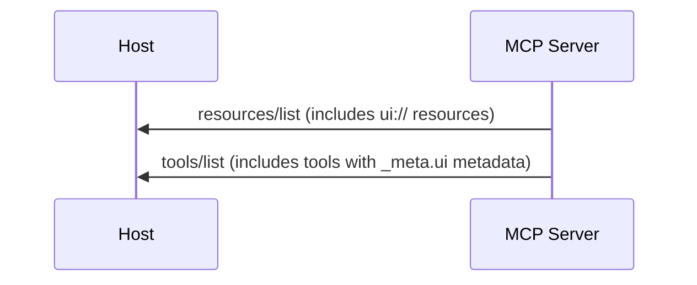
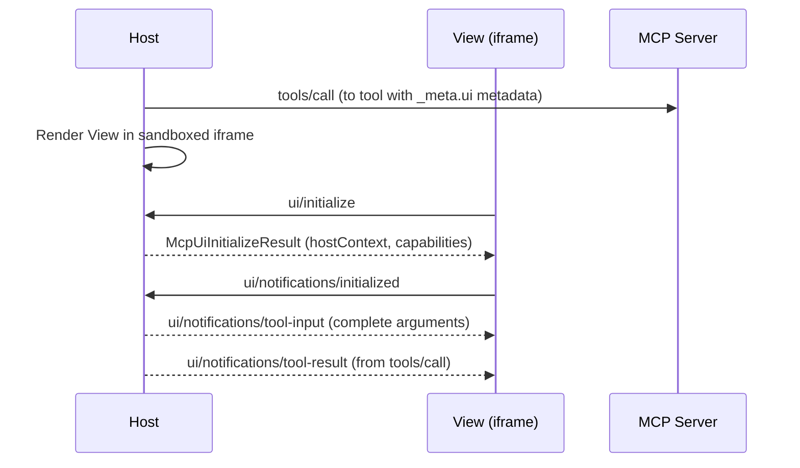
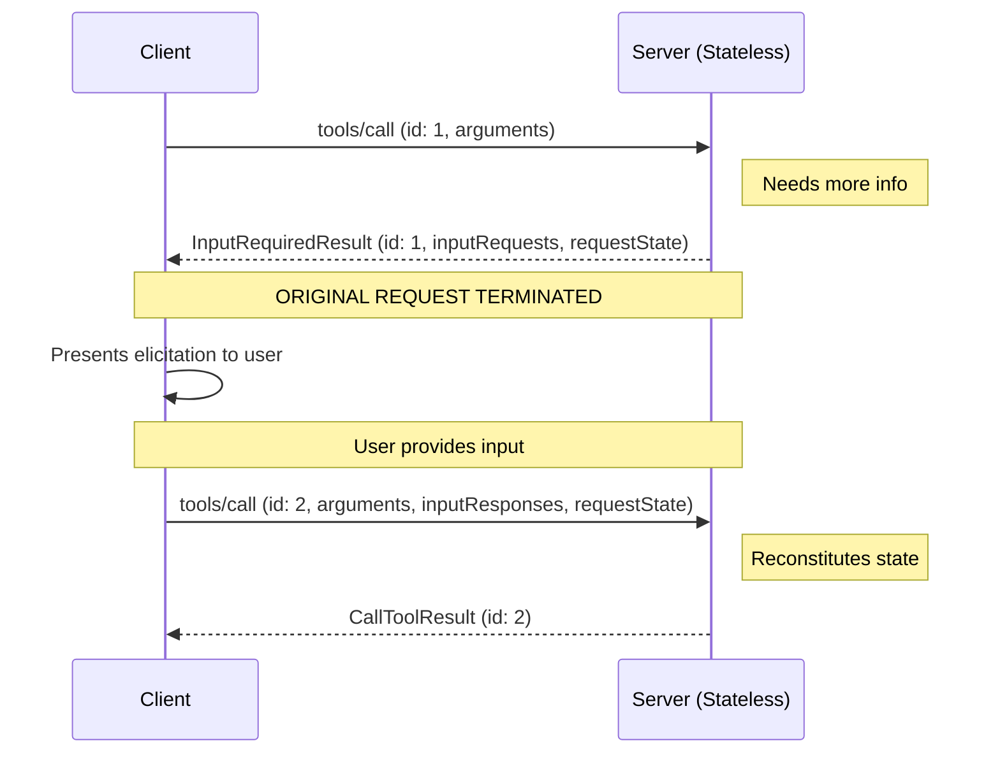
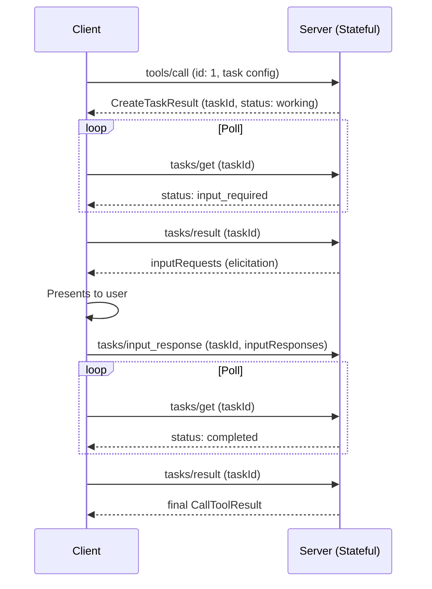
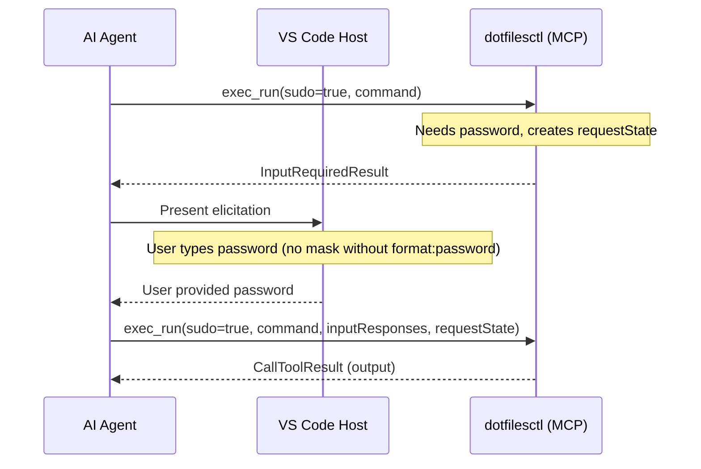

# MCP Apps & Interactive Tool Patterns — Research Document

> Comprehensive findings on MCP Apps (SEP-1865), Multi Round-Trip Requests (SEP-2322),
> Tasks extension, and their implications for the dotfilesd sudo password flow.
> Compiled: 2026-06-25

---

## Table of Contents

1. [MCP Apps (SEP-1865) — Interactive UIs](#1-mcp-apps-sep-1865--interactive-uis)
2. [MCP Apps Lifecycle](#2-mcp-apps-lifecycle)
3. [Communication Protocol](#3-communication-protocol)
4. [Multi Round-Trip Requests (SEP-2322)](#4-multi-round-trip-requests-sep-2322)
5. [Tasks Extension](#5-tasks-extension)
6. [Elicitation](#6-elicitation)
7. [Implications for Sudo Password Flow](#7-implications-for-sudo-password-flow)
8. [References](#8-references)

---

## 1. MCP Apps (SEP-1865) — Interactive UIs

**Status:** Stable (2026-01-26)
**Extension ID:** `io.modelcontextprotocol/ui`
**Specification:** [SEP-1865](https://modelcontextprotocol.io/seps/1865-mcp-apps-interactive-user-interfaces-for-mcp.md)

### What It Is

MCP Apps let servers return **interactive HTML interfaces** that render in a sandboxed iframe
inside the host's chat UI (Claude Desktop, VS Code Copilot, Goose, Postman, etc.).

### Core Pattern

Two primitives work together:

1. **Tool** — declares `_meta.ui.resourceUri` pointing to a `ui://` resource
2. **Resource** — serves the HTML at that URI (MIME type `text/html;profile=mcp-app`)

```jsonc
// Tool definition
{
  "name": "get_weather",
  "inputSchema": { /* ... */ },
  "_meta": {
    "ui": {
      "resourceUri": "ui://weather-server/dashboard",
      "visibility": ["model", "app"]  // default: both
    }
  }
}
```

```jsonc
// resources/read response
{
  "contents": [{
    "uri": "ui://weather-server/dashboard",
    "mimeType": "text/html;profile=mcp-app",
    "text": "<!DOCTYPE html><html>...</html>",
    "_meta": {
      "ui": {
        "csp": {
          "connectDomains": ["https://api.weather.com"],
          "resourceDomains": ["https://cdn.jsdelivr.net"]
        },
        "prefersBorder": true
      }
    }
  }]
}
```

### Tool Visibility

- `"model"` — visible to and callable by the AI agent (default)
- `"app"` — callable by the app from this server only (default)
- `visibility: ["app"]` — tool hidden from agent, only webview can call it
- Host MUST NOT show `["app"]`-only tools to the agent

### Graceful Degradation

Servers SHOULD provide text-only fallback. Tools MUST return meaningful `content`
array even when UI is available. Register different tool variants based on whether
the client advertises MCP Apps support in capabilities.

### Capability Negotiation

```jsonc
// Client advertises MCP Apps support during initialize
{
  "capabilities": {
    "extensions": {
      "io.modelcontextprotocol/ui": {
        "mimeTypes": ["text/html;profile=mcp-app"]
      }
    }
  }
}
```

Server checks `getUiCapability(clientCapabilities)` before registering UI tools.

### Key Design Decisions

- **Predeclared resources** (not inline in tool result) — enables preloading, caching,
  and security review before tool execution
- **Raw HTML MVP** (`text/html;profile=mcp-app`) — universal, simple sandbox model
- **CSS variable theming** — host passes color/typography variables for visual cohesion
- **Visibility array** — replaces OpenAI's two-field approach

---

## 2. MCP Apps Lifecycle

### Phase 1: Connection & Discovery



### Phase 2: UI Initialization



### Phase 3: Interactive Phase

The webview can:
- **Call tools**: `callServerTool({name, arguments})` → `tools/call` proxied to server
- **Send messages**: `ui/message` → adds to conversation context
- **Update model context**: `ui/update-model-context` → feeds data to agent on next turn
- **Log**: `notifications/message`
- **Read resources**: `resources/read`
- **Request display mode change**: `ui/request-display-mode`
- **Request external URL open**: `ui/open-link`

### Phase 4: Cleanup

Host sends `ui/resource-teardown` → View responds → Host destroys iframe.

### Key Lifecycle Insight

**The tool call completes (returns result) BEFORE the UI is rendered.**
The UI receives the tool result via `ui/notifications/tool-result` notification.
There is NO mechanism to suspend/block the tool call while waiting for UI input.

---

## 3. Communication Protocol

### Transport

Uses `postMessage` between host and sandboxed iframe.
Conceptually, the UI acts as an MCP **client** connecting to the host via `MessageTransport`.

### Standard MCP Messages the UI Can Use

- `tools/call` — Execute a tool on the MCP server
- `resources/read` — Read resource content
- `notifications/message` — Log messages
- `ping` — Connection health check

### MCP-App-Specific Messages

**Requests (View → Host):**
| Method | Purpose |
|--------|---------|
| `ui/initialize` | Handshake, carries `appCapabilities` |
| `ui/open-link` | Open external URL |
| `ui/message` | Send message to host's chat |
| `ui/request-display-mode` | Change display mode |
| `ui/update-model-context` | Update model context for next turn |

**Notifications (Host → View):**
| Method | Purpose |
|--------|---------|
| `ui/notifications/tool-input-partial` | (0..n) Partial tool arguments while streaming |
| `ui/notifications/tool-input` | Complete tool arguments (sent once) |
| `ui/notifications/tool-result` | Tool execution result (sent when done) |
| `ui/notifications/tool-cancelled` | Tool execution was cancelled |
| `ui/resource-teardown` | Host notifies before destroying view |
| `ui/notifications/size-changed` | View's rendered size changed |
| `ui/notifications/host-context-changed` | Theme, display mode, etc. changed |

### Data Passing

```typescript
// Tool result sent to View:
{
  content: [{ type: "text", text: "Current weather: Sunny, 72°F" }],
  structuredContent: { temperature: 72, conditions: "sunny" },
  _meta: { timestamp: "2025-11-10T15:30:00Z", source: "weather-api" }
}
```

- `content`: Text for model context and text-only hosts
- `structuredContent`: Data optimized for UI rendering (NOT added to model context)
- `_meta`: Additional metadata (timestamps, version, etc.)

---

## 4. Multi Round-Trip Requests (SEP-2322)

**Status:** Final (Standards Track)
**SEP:** [2322](https://modelcontextprotocol.io/seps/2322-MRTR.md)

### What It Is

A mechanism for servers to request additional input from the client **within the
same logical tool call** — without requiring SSE streams, sticky routing, or shared
server-side state.

This is the closest thing to "blocking until user provides input" in MCP.

### Ephemeral Workflow (Stateless)

Best for tools that don't accumulate server-side state:



Key properties:
- Original request **terminates** (no open connection, no polling)
- `requestState` is opaque — server encodes all accumulated state in it
- Each retry is an independent HTTP request — works with stateless load balancers
- `id` between rounds MUST differ (they're independent requests)

### Persistent Workflow (Stateful, via Tasks)

For long-running operations that accumulate server-side state:



### Schema

```typescript
// Server response when more input needed:
interface InputRequiredResult extends Result {
  resultType: "input_required";
  inputRequests?: {
    [key: string]: InputRequest;  // ElicitRequest | CreateMessageRequest | ListRootsRequest
  };
  requestState?: string;  // Opaque — echoed back by client
}

// Client retry includes:
interface InputResponseRequestParams extends RequestParams {
  inputResponses?: {
    [key: string]: InputResponse;  // ElicitResult | CreateMessageResult | ListRootsResult
  };
  requestState?: string;
}
```

### Supported Client Requests

Servers MAY return `InputRequiredResult` for:
- `GetPromptRequest`
- `ReadResourceRequest`
- `CallToolRequest`
- `GetTaskPayloadRequest`

### Important Limitation

The `InputRequest` type only supports:
- `ElicitRequest` (`elicitation/create`)
- `CreateMessageRequest` (`sampling/createMessage`)
- `ListRootsRequest`

**There is no support for MCP Apps UI resources within MRTR.** You cannot return
a `ui://` resource URI as an input request. The input is always via elicitation
schemas.

### Backward Compatibility

SDKs continue to support inline/blocking elicitation (await inside tool handler)
for single-process servers, but this is **legacy/deprecated**. The new MRTR pattern
is the recommended approach for all servers.

---

## 5. Tasks Extension

**Status:** Active (separate extension)
**Repository:** [experimental-ext-tasks](https://github.com/modelcontextprotocol/experimental-ext-tasks)
**Specification:** [modelcontextprotocol/ext-tasks](https://github.com/modelcontextprotocol/ext-tasks)

### What It Is

Asynchronous task execution for long-running operations. Returns a durable handle
(task ID) instead of blocking.

### Task Lifecycle

| Status | Meaning |
|--------|---------|
| `working` | Operation in progress |
| `input_required` | Server needs client input before continuing |
| `completed` | Operation finished with result |
| `failed` | JSON-RPC error occurred |
| `cancelled` | Operation cancelled (cooperative) |

### API Methods

- `tasks/get` — Poll task status
- `tasks/result` — Get actual input requests or final result
- `tasks/input_response` — Provide input when status is `input_required`
- `tasks/cancel` — Request cancellation
- `notifications/tasks` — Push status updates (optional, if subscribed)

### When to Use

- Long-running operations (CI pipelines, batch processing)
- Human-in-the-loop workflows (approval gates)
- External job system wrappers
- Unreliable connections (task IDs survive disconnects)

---

## 6. Elicitation

**Specification:** [Elicitation](https://modelcontextprotocol.io/specification/2025-11-25/client/elicitation.md)

### What It Is

The standard MCP mechanism for servers to request input from the user.
Uses JSON Schema to describe the expected input.

### Modes

- `form` — Structured form with fields
- `confirm` — Yes/no confirmation
- `terminal` — Raw terminal input

### VS Code Limitation

VS Code's `StringSchema` does **NOT** support `format: "password"`, so password
input is shown in plaintext when using elicitation. This is the root problem that
motivated the MCP Apps approach for sudo password input.

---

## 7. Implications for Sudo Password Flow

### Available Patterns (Ranked)

| Pattern | Mechanism | Blocking? | Password Masking? | Notes |
|---------|-----------|-----------|-------------------|-------|
| **Elicitation (MRTR)** | SEP-2322 ephemeral | ✅ Agent sees one call | ❌ No `format:password` | Cleanest pattern but password in plaintext |
| **MCP Apps + polling** | SEP-1865 webview + `sudo_check` tool | ❌ Requires polling | ✅ `<input type="password">` | Current implementation; requires agent to poll |
| **MCP Apps + MRTR hybrid** | SEP-1865 + SEP-2322 | ❌ Not specified | ✅ | `InputRequest` doesn't support `ui://` resources |
| **Tasks + MCP Apps** | Tasks extension | ❌ Requires polling | ✅ | Most complex; task polls while webview shows UI |
| **Legacy inline elicit** | Block in tool handler | ✅ | ❌ No `format:password` | Requires SSE + sticky routing; deprecated |

### Key Findings

1. **MCP Apps does NOT support blocking/suspending a tool call.**
   The tool call returns its result, then the host renders the UI and sends
   `ui/notifications/tool-result` to the webview. The webview can then call
   tools proactively, but the original `tools/call` is already complete.

2. **SEP-2322 (MRTR) is the closest to "blocking"** — the original tool call
   terminates with `input_required`, the host collects user input via elicitation,
   then retries the same tool call. But it uses elicitation schemas, not MCP Apps HTML.

3. **MRTR does not support MCP Apps resources in `inputRequests`.**
   The `InputRequest` type only supports elicitation, sampling, and list roots.
   A `ui://` resource URI cannot be used as an input request mechanism.

4. **Two-phase flow (current approach) is valid.**
   The agent calls `exec_run(sudo=true)` → gets a pending status + `sudorequestid` →
   renders the HTML webview → waits for user to submit password via webview →
   agent polls `sudo_check` for result. This works with MCP Apps but requires
   the agent to manage the polling loop.

5. **VS Code Copilot supports both MCP Apps AND elicitation.**
   The choice depends on whether password masking is required:
   - If password masking matters → must use MCP Apps webview
   - If password masking doesn't matter → MRTR with elicitation is cleaner

### Recommended Architecture (Current)

```
Agent                    MCP Server (dotfilesctl)          Daemon (dotfilesd)
  |                            |                                |
  |-- exec_run(sudo=true) ---->|                                |
  |                            |-- RequestSudo -> daemon ------>|
  |                            |   (creates pending request)    |
  |<--- _meta + resourceUri --|                                |
  |                            |                                |
  | Host renders HTML webview |                                |
  | User types password       |                                |
  |                            |                                |
  |-- _sudo_submit_password ->|                                |
  |   (password via app tool) |-- SubmitSudo -> daemon ------->|
  |                            |   (executes command with sudo) |
  |                            |                                |
  |-- sudo_check ------------>|                                |
  |                            |-- CheckSudo -> daemon ------->|
  |<--- result or pending ----|                                |
```

### Future Possibilities

If VS Code adds `format: "password"` support to elicitation schemas, the
entire MCP Apps complexity could be replaced with a simple MRTR flow:

```
Agent                    MCP Server
  |                            |
  |-- exec_run(sudo=true) ---->|
  |<--- InputRequiredResult ---| (inputRequests: elicit password)
  |                            |
  | VS Code shows password     |
  | field (masked)             |
  |                            |
  |-- exec_run(sudo=true) ---->| (with inputResponses + requestState)
  |    (new id)                |
  |<--- CallToolResult --------| (sudo executed)
```

---

## 8. References

### Specifications & SEPs

| Document | URL |
|----------|-----|
| MCP Apps Overview | <https://modelcontextprotocol.io/extensions/apps/overview> |
| MCP Apps Build Guide | <https://modelcontextprotocol.io/extensions/apps/build> |
| SEP-1865 (MCP Apps) | <https://modelcontextprotocol.io/seps/1865-mcp-apps-interactive-user-interfaces-for-mcp.md> |
| SEP-2322 (MRTR) | <https://modelcontextprotocol.io/seps/2322-MRTR.md> |
| SEP-1865 Raw Spec | <https://github.com/modelcontextprotocol/ext-apps/blob/main/specification/2026-01-26/apps.mdx> |
| MCP Apps API Docs | <https://apps.extensions.modelcontextprotocol.io/api/> |
| Tasks Overview | <https://modelcontextprotocol.io/extensions/tasks/overview> |
| Elicitation Spec | <https://modelcontextprotocol.io/specification/2025-11-25/client/elicitation.md> |
| Extensions Overview | <https://modelcontextprotocol.io/extensions/overview> |
| Client Matrix | <https://modelcontextprotocol.io/extensions/client-matrix> |

### Repositories

| Repository | URL |
|------------|-----|
| ext-apps (spec + examples) | <https://github.com/modelcontextprotocol/ext-apps> |
| ext-apps examples | <https://github.com/modelcontextprotocol/ext-apps/tree/main/examples> |
| experimental-ext-tasks | <https://github.com/modelcontextprotocol/experimental-ext-tasks> |
| ext-tasks | <https://github.com/modelcontextprotocol/ext-tasks> |
| VS Code Blog: MCP Apps | <https://code.visualstudio.com/blogs/2026/01/26/mcp-apps-support> |

### TypeScript SDK

```typescript
// Server-side helpers (from @modelcontextprotocol/ext-apps)
import {
  registerAppTool,
  registerAppResource,
  RESOURCE_MIME_TYPE,
  getUiCapability,
} from "@modelcontextprotocol/ext-apps/server";

// Client/UI-side (from @modelcontextprotocol/ext-apps)
import { App } from "@modelcontextprotocol/ext-apps";

const app = new App({ name: "My App", version: "1.0.0" });
app.connect();
app.ontoolresult = (result) => { /* handle tool result */ };
await app.callServerTool({ name: "my_tool", arguments: {} });
await app.updateModelContext({ structuredContent: { ... } });
await app.sendMessage("user", "Hello!");
```

### Current Dotfilesd Implementation

The current MCP Apps implementation for sudo password input is in:

- `~/dotfilesd/internal/pkg/cli/mcp.go` — MCP server tools, resource handlers, HTML template
- `~/dotfilesd/internal/pkg/daemon/exec.go` — Daemon-side sudo/exec implementation
- `~/dotfilesd/docs/` — Project documentation
- `/memories/repo/feedback-services.md` — Feedback service architecture notes

---

## Appendix: Protocol Flow Diagrams

### Current: MCP Apps + Polling

```mermaid
sequenceDiagram
  participant Agent as AI Agent
  participant Host as VS Code Host
  participant S as dotfilesctl (MCP)
  participant D as dotfilesd

  Agent->>S: exec_run(sudo=true)
  S->>D: RequestSudo(command)
  D-->>S: pending request ID
  S-->>Agent: _meta.sudorequestid + resourceUri
  Note over Host: Renders HTML password form
  Agent->>Host: Reads resource
  Host->>S: resources/read(uri)
  S-->>Host: HTML with <input type="password">
  Note over Agent: Agent waits...
  Host->>S: _sudo_submit_password(request_id, password)
  S->>D: SubmitSudo(request_id, password)
  D-->>S: auth result
  S-->>Host: password accepted
  Agent->>S: sudo_check(request_id)
  S->>D: CheckSudo(request_id)
  D-->>S: command output
  S-->>Agent: result (stdout/stderr/exit_code)
```



### Alternative: MRTR + Elicitation (if password field supported)


